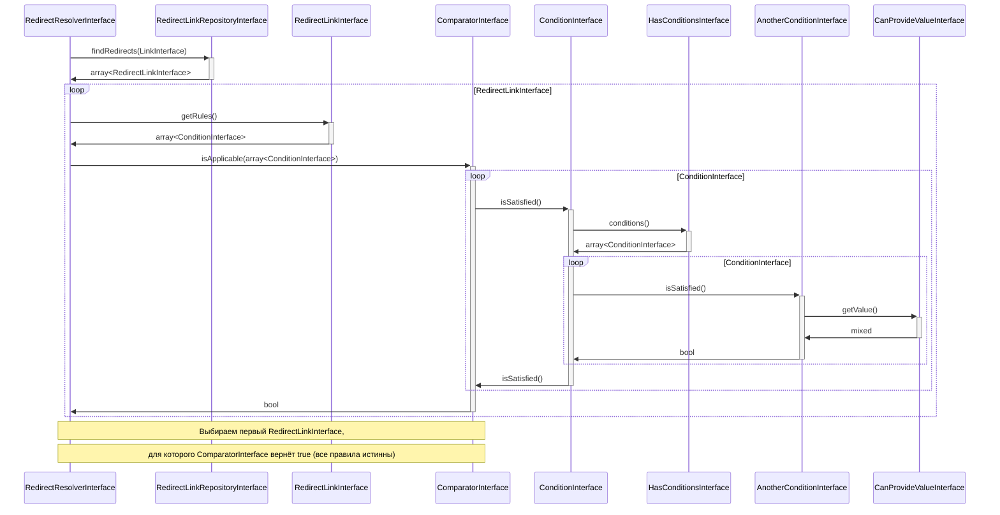

# Smart Links Redirector

**Sequence Diagram**

```mermaid
  sequenceDiagram
    RedirectResolverInterface->>+RedirectLinkRepositoryInterface: findRedirects(LinkInterface)
    RedirectLinkRepositoryInterface->>-RedirectResolverInterface: array<RedirectLinkInterface>
    loop RedirectLinkInterface
        RedirectResolverInterface->>+RedirectLinkInterface: getRules()
        RedirectLinkInterface->>-RedirectResolverInterface: array<ConditionInterface>
        RedirectResolverInterface->>+ComparatorInterface: isApplicable(array<ConditionInterface>)
        loop ConditionInterface
        ComparatorInterface->>+ConditionInterface:isSatisfied()
        ConditionInterface->>+HasConditionsInterface:conditions()
        HasConditionsInterface->>-ConditionInterface:array<ConditionInterface>
            loop ConditionInterface
                ConditionInterface->>+AnotherConditionInterface:isSatisfied()
                AnotherConditionInterface->>+CanProvideValueInterface:getValue()
                CanProvideValueInterface->>-AnotherConditionInterface:mixed
                AnotherConditionInterface->>-ConditionInterface:bool
            end

        ConditionInterface->>-ComparatorInterface:isSatisfied()
        end
        ComparatorInterface->>-RedirectResolverInterface: bool
    end

    Note over RedirectResolverInterface,ComparatorInterface: Выбираем первый RedirectLinkInterface,
    Note over RedirectResolverInterface,ComparatorInterface: для которого ComparatorInterface вернёт true (все правила истинны)
```
